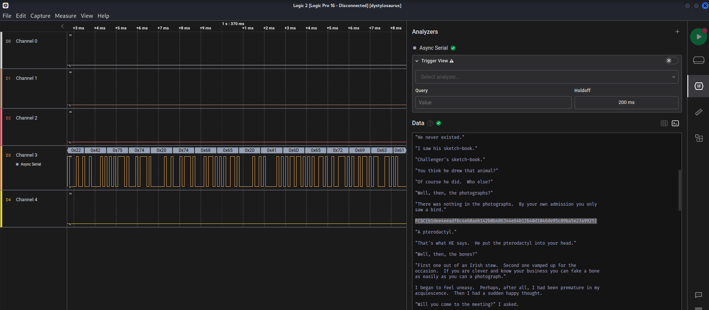

# Intro / Dystylosaurus 

## Challenge
Votre tante paléontologue est portée disparue depuis plusieurs jours. Heureusement, le maire de son village vous a contacté en disant qu'il vient de trouver la tablette à encre électronique de votre tante dans un champ.

Vous venez de réceptionner la tablette, néanmoins elle ne s'allume plus. Après une courte observation, vous remarquez cinqs petits connecteurs sur le côté de la tablette. Vous y connectez un analyseur logique honteusement volé à un autre de vos proches.

Saurez-vous retrouver un indice secret à partir de cette acquisition ?

Note : La capture logique a été réalisée avec le logiciel Saleae Logic 2.

## Inputs
- SAL file: [dystylosaurus.sal](./dystylosaurus.sal)

## Solution
Let's open it with `Saleae Logic 2` (https://www.saleae.com/downloads/)

We see some data on channel 3, revealing an async UART stream.

Decoding it as ASCII characters returned some text and the flag:

## Flag
FCSC{b1dee4eeadf6c4e60aeb142b0b486344e64b12b40d1046de95c89ba5e23a9925}
