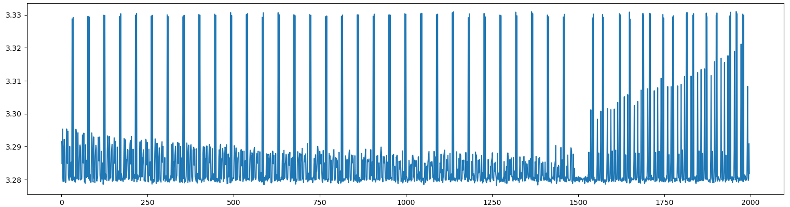
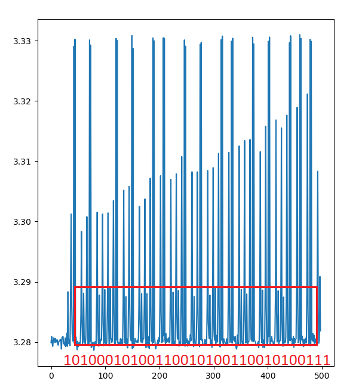
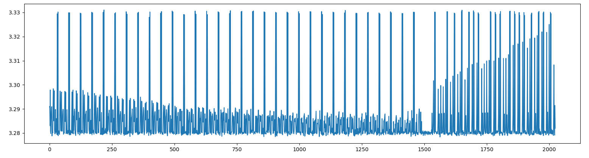
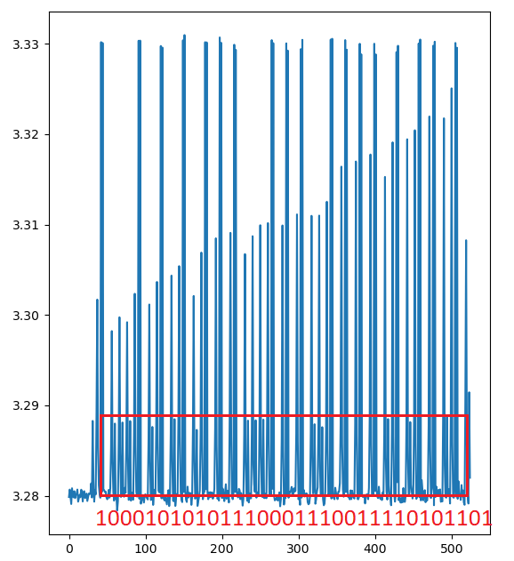

# Intro / SPAnosaurus

## Challenge
La société MegaSecure vient d'éditer une mise à jour de sécurité pour leurs serveurs. Après analyse de la mise à jour, vous vous apercevez que l'éditeur utilise maintenant ce code pour l'exponentiation :

```c
unsigned long exp_by_squaring(unsigned long x, unsigned long n) {
  // n est l'exposant secret
  if (n == 0) {
    return 1;
  } else if (n % 2 == 0) {
    return exp_by_squaring(x * x, n / 2);
  } else {
    return x * exp_by_squaring(x * x, (n - 1) / 2);
  }
}
```

Vous avez accès à un serveur où vous avez pu lancer en tant qu'utilisateur exp_by_squaring(2, 2727955623) tout en mesurant sa consommation d'énergie. L'exposant ici est donc n = 2727955623, soit 10100010100110010100110010100111 en binaire. Cette trace de consommation est sauvegardée dans trace_utilisateur.csv.

Vous avez également réussi à mesurer la consommation d'énergie pendant l'exponentiation d'une donnée de l'administrateur. Cette trace de consommation est sauvegardée dans trace_admin.csv. Saurez-vous retrouver son exposant secret n ?

Le flag est au format FCSC{1234567890} avec 1234567890 à remplacer par l'exposant secret de l'administrateur écrit en décimal.

## Inputs
- user trace: [trace_utilisateur.csv](./trace_utilisateur.csv)
- admin trace: [trace_admin.csv](./trace_admin.csv)


## Solution
Let's write some python code to plot the user data:
```python
import matplotlib.pyplot as plt
import csv
  
y = []
  
with open('trace_utilisateur.csv','r') as csvfile:
    plots = csv.reader(csvfile)
      
    for row in plots:
        y.append(float(row[0][:-4]))
  
plt.plot(y[1500:])
plt.show()
```



The data seems located in the ends, so let's focus on it.



We can clearly recognise the data `10100010100110010100110010100111`, which is the binary representation of the user's exponentiation value `n = 2727955623`.

Let's do the same for the admin log:



It's the same, the data is located at the end, so we can focus on it here again.



Now we can decode the data `10001010101110001110011110101101`, which is the binary representation of the admin's exponentiation value `n = 2327373741`.

## Flag
FCSC{2327373741}
