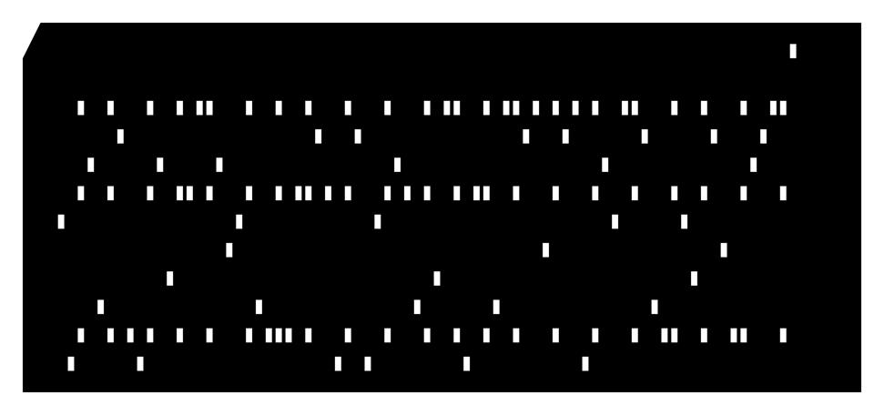

# Misc / Des p'tits trous

## Challenge
Lorsqu'il explore la cave de la maison familiale, un ami à vous tombe sur les archives de son grand père, pionnier de l'informatique dans les années 70. Parmi la myriade de documents, il trouve des cartes perforées accompagnées d'un document, ainsi que de la mention "IBM029". Sur les 79 cartes seules les 53 premières sont correctement numérotées, les dernières étaient dans une boîte qui a souffert du temps et a effacé les étiquettes collées dessus.

Curieux de ce que ces cartes perforées renferment, il les scanne et vous fournit le fichier cards.tar.gz pour que vous l'analysiez. Saurez-vous l'aider ?

## Inputs
- scaned punched cards in [cards.tar.gz](./cards.tar.gz)

## Solution
Let's look at one punched card:



Of course, there's already some code to read such things: https://github.com/lemonad/punched-card-cv.git

It uses `OpenCV` to manipulate the images.

But the code doesn't exactly work out of the box:
- Our punched cards are black on a white background, which should be the opposite: we can fix with `OpenCV`'s function `cv2.bitwise_not()`
- The code crashes on execution: minor changes are needed to comply to new `OpenCV` API

Here's the minor changes to make it work:
```diff
diff --git a/readcard.py b/readcard.py
index fe02f43..d346baa 100644
--- a/readcard.py
+++ b/readcard.py
@@ -64,7 +64,7 @@ def find_corner (thresh):

     """
     # Find minimum polygon that surrounds card.
-    im2, contours, hierarchy = cv2.findContours(thresh.copy(),
+    contours, hierarchy = cv2.findContours(thresh.copy(),
                                                 cv2.RETR_CCOMP,
                                                 cv2.CHAIN_APPROX_NONE)
     # Approximate bounding box to a small number of points. Since the cards
@@ -175,7 +175,7 @@ def get_corner_black_pixel_count (thresh, pts):

 def transform(thresh, upper_left, upper_right, lower_right, lower_left):
     """Perspective transform image."""
-    im2, contours, hierarchy = cv2.findContours(thresh,
+    contours, hierarchy = cv2.findContours(thresh,
                                                 cv2.RETR_TREE,
                                                 cv2.CHAIN_APPROX_SIMPLE)
     cnt = contours[0]
@@ -201,13 +201,14 @@ def transform(thresh, upper_left, upper_right, lower_right, lower_left):
     dst = np.array(([0, 0], [w, 0], [w, h], [0, h]), dtype=np.float32)

     transformation = cv2.getPerspectiveTransform(src, dst)
-    imdst = cv2.warpPerspective(thresh, transformation, (w, h))
+    imdst = cv2.warpPerspective(thresh, transformation, (int(w), int(h)))
     return imdst


 def read_card(image_path):
     """Read a punched card from a photo."""
-    cardim = cv2.imread(image_path, cv2.IMREAD_GRAYSCALE)
+    cardim_ = cv2.imread(image_path, cv2.IMREAD_GRAYSCALE)
+    cardim  = cv2.bitwise_not(cardim_)

     # Dilate and threshold in order to try and remove text and
     # other information on the card
```

Now we need to iterate on our punched cards like so:
```console
$ for card in ../cards/*.jpg; do python3 readcard.py $card; done
! --------------------------------------------------
MODULE HELLO_1         ! BEGIN S1,S2,H,SS DEFINITION
! --------------------------------------------------
  INTEGER :: S1(256) = (/ 96,172,121,222,15,140,53,104,39,145,51,250,217,  &
 27,32,127,70,179,21,46,236,189,143,133,77,171,208,223,113,139,158,54,203,227,&
 160, &
 95,99,155,85,169,103,130,238,31,226,41,52,90,152,183,8,173,72,131,229,231,243,&
 184, &
 199,146,134,6,249,4,117,84,151,201,47,25,180,33,79,230,166,142,10,161,233,7,&
 112, &
 255,126,19,138,193,83,125,168,106,24,48,198,177,209,2,56,185,108,16,200,65, &
 186, &
 225,12,167,137,105,98,43,62,150,147,38,149,251,49,234,119,212,29,86,129,110,&
 93, &
 204,9,34,74,73,176,120,195,67,205,123,196,244,175,241,102,245,162,248,218, &
 232,219,  &
 59,28,197,87,170,221,57,92,214,37,247,116,100,26,239,107,216,188,148,22,&
 60,192,  &
 13,23,80,91,44,66,42,153,18,40,76,165,220,206,144,115,82,114,20,253,202,&
 174,215,  &
 163,211,78,124,228,11,0,1,97,58,35,128,61,14,159,17,132,94,178,252,182,&
 240,111,  &
 141,71,187,235,213,154,63,190,3,45,75,191,135,207,101,88,118,181,89,164,&
 50,36,55,  &
 246,81,254,242,30,210,194,237,157,136,224,69,109,156,122,64,5,68 /)
  INTEGER :: S2(256) = (/ 216,182,122,143,69,3,117,72,42,134,53,75,179,  &
 49,27,189,26,30,254,78,83,139,194,237,60,93,70,105,109,240,178,46,158,210,&
 193,24,  &
 172,141,23,156,234,31,220,62,145,127,4,51,19,176,247,255,111,81,55,135,71,&
 0,177,  &
 38,211,155,166,90,181,224,202,195,137,221,43,170,201,159,230,44,108,196,&
 133,132,  &
 183,144,225,120,129,147,121,164,136,45,157,1,186,115,13,206,68,217,252,&
 251,233,  &
 95,59,184,187,241,37,113,98,25,162,235,118,47,79,35,80,50,89,250,192,229,&
 110,56,  &
 58,185,40,150,253,205,191,87,231,124,223,198,173,160,142,222,239,226,190,&
 168,167,  &
 174,207,21,140,76,28,52,152,100,14,16,48,163,92,33,197,154,238,161,15,84,&
 116,11,  &
 12,73,232,128,215,67,204,8,209,20,96,17,200,188,9,214,104,131,91,64,99,18,&
 61,249,  &
 203,153,138,36,103,5,39,22,151,227,41,165,219,246,101,74,236,65,218,180,148,&
 123,  &
 242,85,57,29,169,63,54,146,245,7,77,106,32,208,126,149,175,94,212,130,114,6,&
 125,  &
 213,112,119,66,244,102,82,10,97,248,86,107,243,34,228,171,2,199,88 /)
  INTEGER :: H(30) = (/ 17,10,1,18,25,28,27,14,22,20,4,8,15,5,26,19,6,12,  &
 7,21,3,29,13,23,9,24,0,16,11,2 /)
  INTEGER :: SS(30) = (/ 68,180,51,31,68,20,206,229,56,160,219,251,169,  &
 184,56,229,206,66,160,186,51,153,83,68,56,157,160,68,56,187 /)
 END MODULE ! END S1,S2,H,SS DEFINITION (END HELLO_1)
! --------------------------------------------------
901 FORMAT (99A)
  DO I = 0,29,1
! - - - - - -
  DO I = 0,29,1
  CHARACTER :: SSSS(0:255)
  INTEGER :: SSS(0:255)
  END DO
! - - - - - -
END PROGRAM
PROGRAM HELLO
    SSSS(I:I) = CHAR(SSS(I:I))
    SSS(I:I) = S2(SS(I+1)+1:SS(I+1)+1)
  INTEGER :: I
USE HELLO_1
  END DO
! --------------------------------------------------
  WRITE (*,901,ADVANCE='YES') ''
  STOP 0
  DO I = 0,29,1
IMPLICIT NONE
  DO I = 0,29,1
    SS(H(I+1)+1:H(I+1)+1) = SSS(I:I)
    WRITE (*,901,ADVANCE='NO') SSSS(I:I)
    SSS(I:I) = S1(SS(I+1)+1:SS(I+1)+1)
  END DO
  END DO
```

This is a `FORTRAN` program. But the ends looks puzzled. Remember, only the 59 first cards were corectly numbered, so the last 26 cards are mixed up. Hence the 26 last lines above are mixed up as well. The 53 first lines exactly consist of the module `HELLO_1`. Putting the main program in order should look something like this (might not be exactly it though):
```
IMPLICIT NONE

USE HELLO_1 ! defines S1,S2,H,SS

! - - - - - -
901 FORMAT (99A)
  STOP 0

! - - - - - -
PROGRAM HELLO

  CHARACTER :: SSSS(0:255)
  INTEGER :: SSS(0:255)
  INTEGER :: I

  WRITE (*,901,ADVANCE='YES') ''

  DO I = 0,29,1
    SSS(I:I) = S1(SS(I+1)+1:SS(I+1)+1)
    SSS(I:I) = S2(SS(I+1)+1:SS(I+1)+1)
  END DO

  DO I = 0,29,1
    SS(H(I+1)+1:H(I+1)+1) = SSS(I:I)
  END DO

  DO I = 0,29,1
    SSSS(I:I) = CHAR(SSS(I:I))
  END DO

  DO I = 0,29,1
    WRITE (*,901,ADVANCE='NO') SSSS(I:I)
  END DO

END PROGRAM
! --------------------------------------------------
```

Let's reproduce it in python:
```python
S1 = [96,172,121,222,15,140,53,104,39,145,51,250,217,27,32,127,70,179,21,46,236,189,143,133,77,171,208,223,113,139,158,54,203,227,160,95,99,155,85,169,103,130,238,31,226,41,52,90,152,183,8,173,72,131,229,231,243,184,199,146,134,6,249,4,117,84,151,201,47,25,180,33,79,230,166,142,10,161,233,7,112,255,126,19,138,193,83,125,168,106,24,48,198,177,209,2,56,185,108,16,200,65,186,225,12,167,137,105,98,43,62,150,147,38,149,251,49,234,119,212,29,86,129,110,93,204,9,34,74,73,176,120,195,67,205,123,196,244,175,241,102,245,162,248,218,232,219,59,28,197,87,170,221,57,92,214,37,247,116,100,26,239,107,216,188,148,22,60,192,13,23,80,91,44,66,42,153,18,40,76,165,220,206,144,115,82,114,20,253,202,174,215,163,211,78,124,228,11,0,1,97,58,35,128,61,14,159,17,132,94,178,252,182,240,111,141,71,187,235,213,154,63,190,3,45,75,191,135,207,101,88,118,181,89,164,50,36,55,246,81,254,242,30,210,194,237,157,136,224,69,109,156,122,64,5,68]

S2 = [216,182,122,143,69,3,117,72,42,134,53,75,179,49,27,189,26,30,254,78,83,139,194,237,60,93,70,105,109,240,178,46,158,210,193,24,172,141,23,156,234,31,220,62,145,127,4,51,19,176,247,255,111,81,55,135,71,0,177,38,211,155,166,90,181,224,202,195,137,221,43,170,201,159,230,44,108,196,133,132,183,144,225,120,129,147,121,164,136,45,157,1,186,115,13,206,68,217,252,251,233,95,59,184,187,241,37,113,98,25,162,235,118,47,79,35,80,50,89,250,192,229,110,56,58,185,40,150,253,205,191,87,231,124,223,198,173,160,142,222,239,226,190,168,167,174,207,21,140,76,28,52,152,100,14,16,48,163,92,33,197,154,238,161,15,84,116,11,12,73,232,128,215,67,204,8,209,20,96,17,200,188,9,214,104,131,91,64,99,18,61,249,203,153,138,36,103,5,39,22,151,227,41,165,219,246,101,74,236,65,218,180,148,123,242,85,57,29,169,63,54,146,245,7,77,106,32,208,126,149,175,94,212,130,114,6,125,213,112,119,66,244,102,82,10,97,248,86,107,243,34,228,171,2,199,88]

H = [17,10,1,18,25,28,27,14,22,20,4,8,15,5,26,19,6,12,7,21,3,29,13,23,9,24,0,16,11,2]

SS = [68,180,51,31,68,20,206,229,56,160,219,251,169,184,56,229,206,66,160,186,51,153,83,68,56,157,160,68,56,187]

SSS = [0,0,0,0,0,0,0,0,0,0,0,0,0,0,0,0,0,0,0,0,0,0,0,0,0,0,0,0,0,0]
for I in range(29):
    SSS[I] = S1[SS[I]]

for I in range(29):
    SS[H[I]] = SSS[I]

for I in range(29):
    SSS[I] = S2[SS[I]]

print(''.join(chr(x) for x in SSS))
```

Let's run it and we get the flag (with a slight error that is easily recovered):
```console
$ python3 prog.py
FCÿC{#!F0RTR4N_1337_FOR3V3R!}
```

## Python code
Complete solution in [prog.py](./prog.py)

## Flag
FCSC{#!F0RTR4N_1337_FOR3V3R!}

