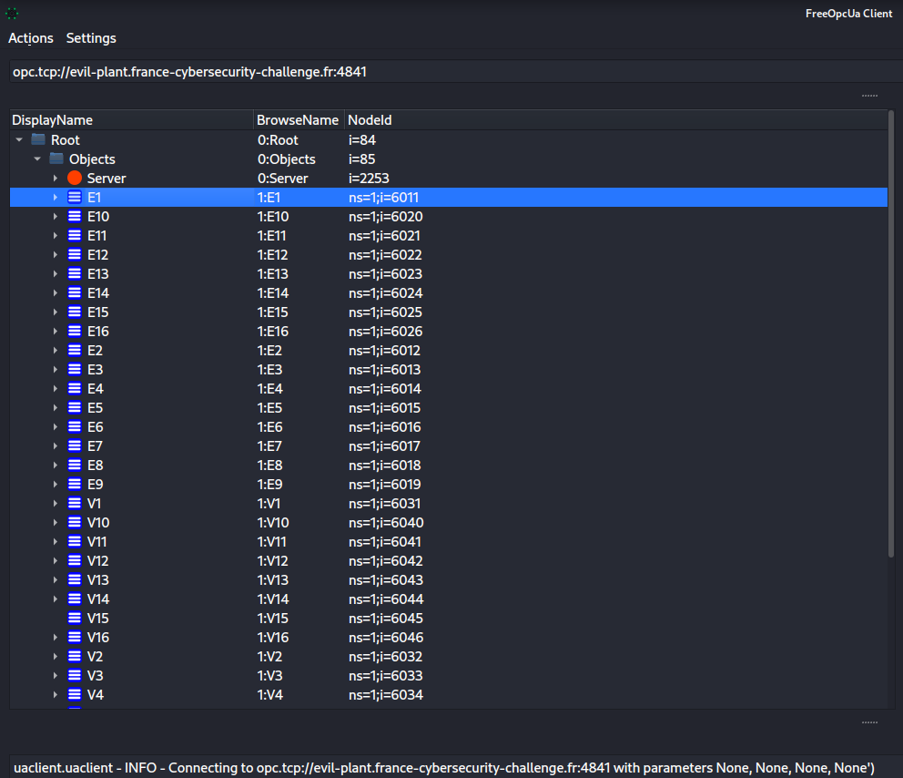
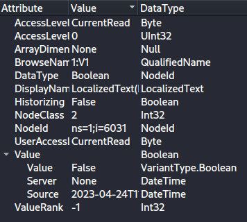
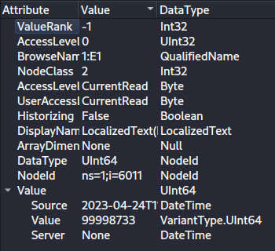

# Misc / Evil plant

## Challenge
D'après nos analyses couplées à nos relevés satellites, nous avons confirmation que la cible, sous couverture d'être une usine de production de vaccins, est en réalité une usine de production de liquide toxique utilisée à des fins militaires.

Les reconnaissances du réseau effectuées nous indiquent que la cible est contrôlée par un automate programmable industriel, lui-même communiquant via une interface SCADA par le protocole OPC-UA en mode binaire. Nous avons exposé la cible sur internet via un implant UMTS, celle-ci est désormais accessible sur le réseau :

evil-plant.france-cybersecurity-challenge.fr:4841

Un screenshot de l'interface SCADA à un temps indéterminé a également pu être récupéré :

L'analyse des documents d'ingénierie récupérés a montré que la formule du liquide toxique est composée de 16 éléments. Nous ignorons les taux utilisés dans la formule ainsi que l'ordonnancement des différents éléments : nous faisons appel à vous pour les récupérer.

Il semblerait que les éléments soient ajoutés dans la cuve MIX (en bas du screenshot) deux par deux, mais pour pouvoir créer un remède efficace, nous avons besoin de savoir exactement dans quel ordre et avec quels taux les couples d'éléments sont mélangés.

Faites vite, le temps presse...

Note : Le numéro des éléments dans un couple d'éléments est à indiquer dans l'ordre croissant (030c et pas 0c03 dans l'étape 2 de l'exemple ci-dessous), et les taux correspondants dans le même ordre.

Exemple : On donne un exemple du format du flag à soumettre. Supposons que le processus de fabrication comporte les trois étapes suivantes :

    Étape 1 : ajout de 27 unités (0x1b) de l'élément 1 (0x01) et de 47 unités (0x2f) de l'élément 8 (0x08) dans la cuve MIX.
    Étape 2 : ajout de 95 unités (0x5f) de l'élément 12 (0x0c) et de 141 unités (0x8d) de l'élément 3 (0x03) dans la cuve MIX.
    Étape 3 : ajout de 230 unités (0xe6) de l'élément 5 (0x05) et de 177 unités (0xb1) de l'élément 16 (0x10) dans la cuve MIX.

Le flag à soumettre serait FCSC{01081b2f030c8d5f0510e6b1}, où toutes les valeurs sont exprimées en notation hexadécimale.


## Inputs
- OPC-UA server at evil-plant.france-cybersecurity-challenge.fr:4841

## Solution
The OUA-server can be accessed at `opc.tcp://evil-plant.france-cybersecurity-challenge.fr:4841`.

After reading some documentation about OPC-UA and client implementations on `github`, I found following:
- an asyncio-based asynchronous OPC UA client and server based on python-opcua at https://github.com/FreeOpcUa/opcua-asyncio
- a Simple OPC-UA GUI client at https://github.com/FreeOpcUa/opcua-client-gui

Let's check the GUI client first and connect to the `evil-plant` OPC-UA server. The client successfully connects to the server and lists the various objects: 

We see the various valves and elements. We can select an element and disply its attributes.

For instance, valve V1 has a `boolean value` set to `False`, meaning that the valve is closed: 

Another example is element E1, which has a `uint64 value` set to 99998733, which is current quantity for element E1: 

The tool is nice, but we need to script the interaction with the OPC-UA server in order to see what's going on exactly.

First we connect to the server:
```python
    srv_url="opc.tcp://evil-plant.france-cybersecurity-challenge.fr:4841"
    client = Client(srv_url)
    client.connect()
```

Then we get the root node and its objects:
```python
    root = client.get_root_node()
    objs = client.get_objects_node()
```

Requesting values for valves and dumping the valve nodes names and label/text:
```python
def get_valves(client, objs):
    # Get list of valves nodes
    nodes = list(); names = list()
    list_child = objs.get_children()
    for child in list_child:
        name = child.get_display_name().Text
        if name[0] == 'V' or name == 'VMIX':
            nodes.append(child)
            names.append(name)
    print(names)
```

Here's the output execution that shows the same output from the GUI:
```console
Requested session timeout to be 3600000ms, got 600000ms instead
[Node(FourByteNodeId(ns=1;i=6031)), Node(FourByteNodeId(ns=1;i=6032)), Node(FourByteNodeId(ns=1;i=6033)), Node(FourByteNodeId(ns=1;i=6034)), Node(FourByteNodeId(ns=1;i=6035)), Node(FourByteNodeId(ns=1;i=6036)), Node(FourByteNodeId(ns=1;i=6037)), Node(FourByteNodeId(ns=1;i=6038)), Node(FourByteNodeId(ns=1;i=6039)), Node(FourByteNodeId(ns=1;i=6040)), Node(FourByteNodeId(ns=1;i=6041)), Node(FourByteNodeId(ns=1;i=6042)), Node(FourByteNodeId(ns=1;i=6043)), Node(FourByteNodeId(ns=1;i=6044)), Node(FourByteNodeId(ns=1;i=6045)), Node(FourByteNodeId(ns=1;i=6046)), Node(FourByteNodeId(ns=1;i=6051))]
['V1', 'V2', 'V3', 'V4', 'V5', 'V6', 'V7', 'V8', 'V9', 'V10', 'V11', 'V12', 'V13', 'V14', 'V15', 'V16', 'VMIX']
```

Now, what we're going to do is to poll the status of the valves, say every 2s (try-error) and do a dummy print to visualize how the valves are actionned:
```console
$ python3 client.py
Requested session timeout to be 3600000ms, got 600000ms instead
['V1', 'V2', 'V3', 'V4', 'V5', 'V6', 'V7', 'V8', 'V9', 'V10', 'V11', 'V12', 'V13', 'V14', 'V15', 'V16', 'VMIX']

      x   x     x
 x          x   x

     x        x x
       x   x    x


        xx      x
    x        x  x


x x             x
      x   x     x
 x          x   x

     x        x x
       x   x    x

   x           xx
        xx      x
    x        x  x


x x             x
      x   x     x


     x        x x
       x   x    x

   x           xx
        xx      x

    x        x  x


```

So we see a repeating pattern, indeed showing two elements being added in the mix two by two.
- V1, V3
- V7, V11
- V6, V15
- V8, V12
- V4, V16
- V9, V10
- V5, V14

Now we need the quantities !

Let's poll the status of both valves and elements this time, say every 1s and log the differences in element quantities. We need to identify the beginning of the cycle (when valves V1 and V3 are activated) and the end of the cycle (when valves V5 and V14 are activated), so that we get all quantity changes in a cycle. The result is like so, with the flag being built following the rules in the description. Here's the execution output::

```console
$ python3 client.py
Requested session timeout to be 3600000ms, got 600000ms instead
   x           xx

        xx      x
        xx      x E9=-183 E10=-176

    x        x  x
    x        x  x E5=-230 E14=-143


x x             x
x x             x E1=-1 E3=-193
      x   x     x
      x   x     x E7=-56 E11=-29

 x          x   x
 x          x   x E2=-201 E13=-238

     x        x x
     x        x x E6=-141 E15=-199

       x   x    x
                  E8=-200 E12=-231
   x           xx
   x           xx E4=-145 E16=-139

        xx      x
        xx      x E9=-183 E10=-176

    x        x  x
    x        x  x E5=-230 E14=-143
FCSC{010301c1070b381d020dc9ee060f8dc7080cc8e70410918b090ab7b0050ee68f}
```

## Python code
Complete solution in [client.py](./client.py)

## Flag
FCSC{010301c1070b381d020dc9ee060f8dc7080cc8e70410918b090ab7b0050ee68f}